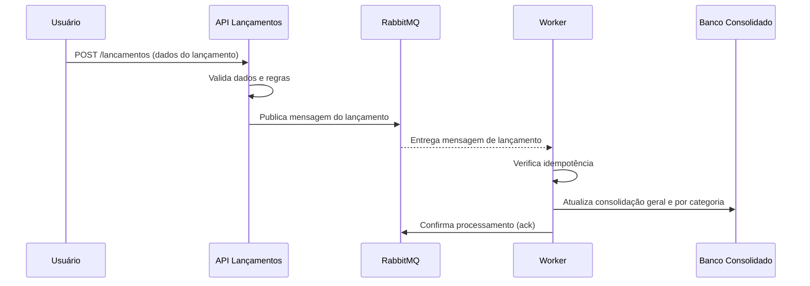
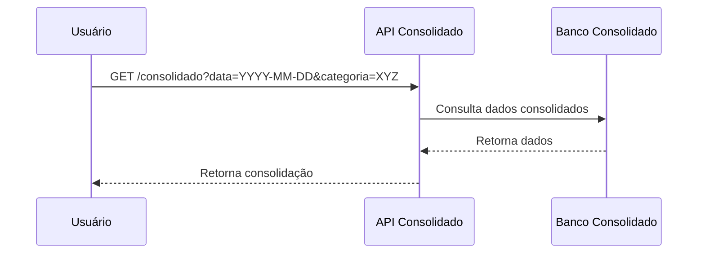
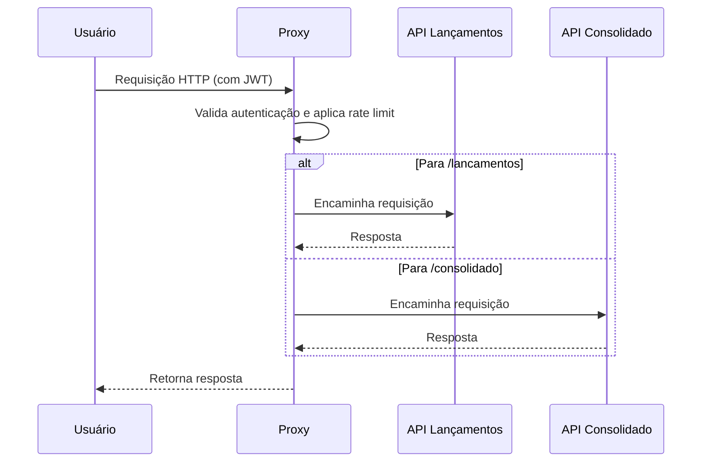

# Diagramas de Sequência - Fluxos Principais do Sistema

## 1. Fluxo de Criação de Lançamento e Consolidação

```mermaid
sequenceDiagram
    participant Usuário
    participant API_Lancamentos as API Lançamentos
    participant RabbitMQ
    participant Worker
    participant DB_Consolidado as Banco Consolidado

    Usuário->>API_Lancamentos: POST /lancamentos (dados do lançamento)
    API_Lancamentos->>API_Lancamentos: Valida dados e regras
    API_Lancamentos->>RabbitMQ: Publica mensagem do lançamento
    RabbitMQ-->>Worker: Entrega mensagem de lançamento
    Worker->>Worker: Verifica idempotência
    Worker->>DB_Consolidado: Atualiza consolidação geral e por categoria
    Worker->>RabbitMQ: Confirma processamento (ack)
```

## 2. Fluxo de Consulta de Consolidação

```mermaid
sequenceDiagram
    participant Usuário
    participant API_Consolidado as API Consolidado
    participant DB_Consolidado as Banco Consolidado

    Usuário->>API_Consolidado: GET /consolidado?data=YYYY-MM-DD&categoria=XYZ
    API_Consolidado->>DB_Consolidado: Consulta dados consolidados
    DB_Consolidado-->>API_Consolidado: Retorna dados
    API_Consolidado-->>Usuário: Retorna consolidação
```

## 3. Fluxo de Proxy e Autenticação

```mermaid
sequenceDiagram
    participant Usuário
    participant Proxy
    participant API_Lancamentos as API Lançamentos
    participant API_Consolidado as API Consolidado

    Usuário->>Proxy: Requisição HTTP (com JWT)
    Proxy->>Proxy: Valida autenticação e aplica rate limit
    alt Para /lancamentos
        Proxy->>API_Lancamentos: Encaminha requisição
        API_Lancamentos-->>Proxy: Resposta
    else Para /consolidado
        Proxy->>API_Consolidado: Encaminha requisição
        API_Consolidado-->>Proxy: Resposta
    end
    Proxy-->>Usuário: Retorna resposta
```
