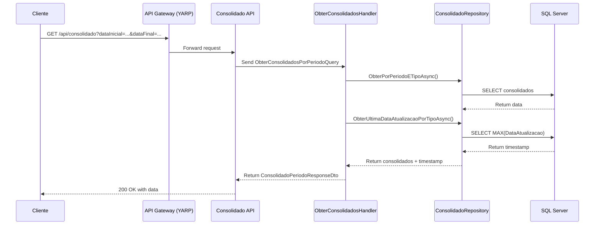

# RProg.FluxoCaixa.Consolidado API

API para consulta de dados consolidados por período e categoria utilizando padrão CQRS, seguindo Clean Architecture e boas práticas de desenvolvimento .NET.

## Características

- **Padrão CQRS** com MediatR para queries otimizadas
- **Validação de período** (data final não pode ser inferior à inicial)
- **Último horário de consolidação** retornado em cada consulta
- **Performance otimizada** com queries SQL diretas via Dapper
- **Documentação XML** completa para controllers e DTOs
- **Configurações** centralizadas no appsettings.json
- **Logging** estruturado com Serilog
- **Testes unitários** com xUnit, Moq e FluentAssertions

## Arquitetura

O projeto segue os princípios de Clean Architecture:

```
Domain/
├── Entities/           # Entidades de domínio
Application/
├── DTOs/              # Data Transfer Objects
├── Queries/           # Queries CQRS com handlers
Infrastructure/
├── Data/              # Repositórios e acesso a dados
Controllers/           # Controllers da API REST
```



Principais padrões e práticas:
- SOLID, KISS, DRY
- Injeção de dependência
- Repositório, CQRS, Mediator
- Logging estruturado

## Endpoints da API

### GET /api/consolidado
Consulta dados consolidados por período.

**Parâmetros:**
- `dataInicial` (DateTime): Data inicial do período
- `dataFinal` (DateTime): Data final do período

**Exemplo:**
```http
GET /api/consolidado?dataInicial=2024-01-01&dataFinal=2024-01-31
```

### GET /api/consolidado/categoria/{categoria}
Consulta dados consolidados por período e categoria específica.

**Parâmetros:**
- `categoria` (string): Categoria específica para filtro
- `dataInicial` (DateTime): Data inicial do período
- `dataFinal` (DateTime): Data final do período

**Exemplo:**
```http
GET /api/consolidado/categoria/ALIMENTACAO?dataInicial=2024-01-01&dataFinal=2024-01-31
```

## Exemplo de Resposta

```json
{
  "dataInicial": "2024-01-01T00:00:00",
  "dataFinal": "2024-01-31T00:00:00",
  "consolidados": [
    {
      "data": "2024-01-01T00:00:00",
      "categoria": "ALIMENTACAO",
      "tipoConsolidacao": "CATEGORIA",
      "totalCreditos": 0.00,
      "totalDebitos": -150.75,
      "saldoLiquido": -150.75,
      "quantidadeLancamentos": 3,
      "dataAtualizacao": "2024-01-01T18:30:00"
    }
  ],
  "ultimaConsolidacao": "2024-01-01T18:30:00",
  "totalRegistros": 1
}
```

## Configuração

### Banco de Dados
Configure a connection string no `appsettings.json`:

```json
{
  "ConnectionStrings": {
    "DefaultConnection": "Server=localhost;Database=FluxoCaixa_Consolidado;Trusted_Connection=true;TrustServerCertificate=true;"
  }
}
```

### Logging
O projeto utiliza Serilog configurado para:
- Console output em desenvolvimento
- Arquivo de log com rotação diária
- Logs estruturados em JSON

## Execução

### Desenvolvimento Local (.NET)
```cmd
# Compilar
dotnet build

# Executar
dotnet run

# Executar testes
dotnet test

# Acessar Swagger
# Navegue para https://localhost:7002/swagger
```

### Docker (Recomendado)

#### Usando PowerShell (Windows)
```powershell
# Iniciar ambiente completo
.\dev.ps1 start

# Ver logs em tempo real
.\dev.ps1 logs

# Executar testes
.\dev.ps1 test

# Parar serviços
.\dev.ps1 stop
```

#### Usando Docker Compose diretamente
```cmd
# Ambiente de desenvolvimento (isolado)
docker-compose -f docker-compose.dev.yaml up --build

# Ambiente completo (com outros serviços)
cd ..\
docker-compose up --build
```

**URLs Docker:**
- API: http://localhost:8081
- Swagger: http://localhost:8081/swagger  
- Health Check: http://localhost:8081/health

📋 **Documentação Docker detalhada:** [DOCKER.md](DOCKER.md)

## Dependências

- **.NET 8.0**
- **MediatR** - Padrão CQRS
- **Dapper** - ORM leve para performance
- **Serilog** - Logging estruturado
- **Microsoft.Data.SqlClient** - Acesso ao SQL Server
- **Swashbuckle** - Documentação Swagger

## Validações

- Data final deve ser maior ou igual à data inicial
- Categoria não pode ser vazia quando especificada na rota
- Parâmetros de data são obrigatórios
- Tratamento de exceções com logging detalhado

## Padrões e Boas Práticas

- Seguir padrões de codificação C# e nomenclatura conforme instruções do repositório
- Utilizar injeção de dependência sempre que possível
- Separar código em métodos coesos e pequenos
- Utilizar comentários XML e explicativos para regras de negócio e integrações
- Utilizar princípios SOLID, KISS e DRY
- Utilizar repositórios para abstração de dados
- Facilitar a criação de testes unitários

## Testes

- Testes unitários obrigatórios para todo novo código
- Utilizar xUnit, Moq, Bogus e FluentAssertions
- Estruturar testes com AAA (Arrange, Act, Assert) e Given/When/Then
- Mocks para dependências externas
- Projeto de testes: `RProg.FluxoCaixa.Consolidado.Test`

## Links Úteis

- [Documentação Docker detalhada](DOCKER.md)
- [Especificação de arquitetura](../../docs/documento-arquitetural.md)
- [Diagrama de containers](../../docs/C4DiagramaContainer.png)
- [Diagrama de contexto](../../docs/C4DiagramaContexto.png)

---

> Para dúvidas sobre padrões, consulte o arquivo `.github/instructions/copilot.instructions.md`.
