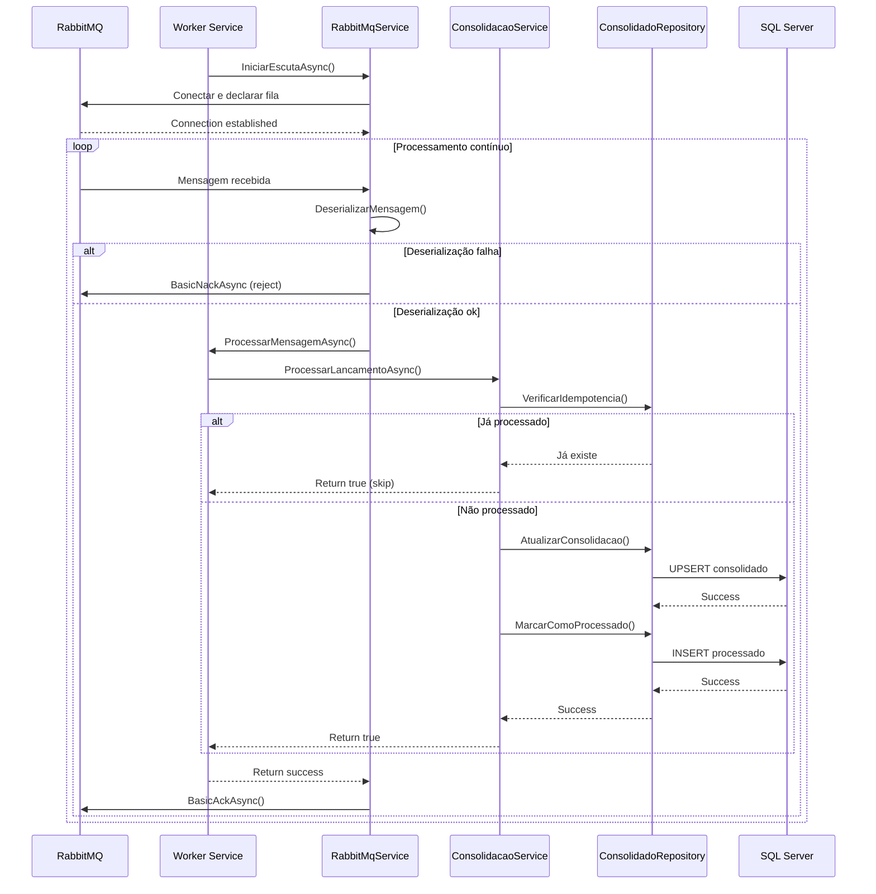
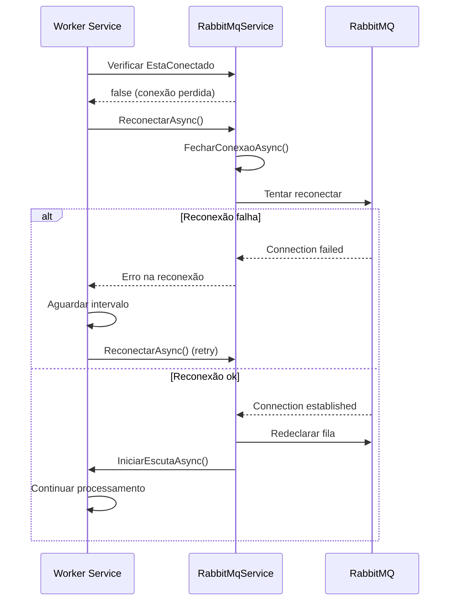
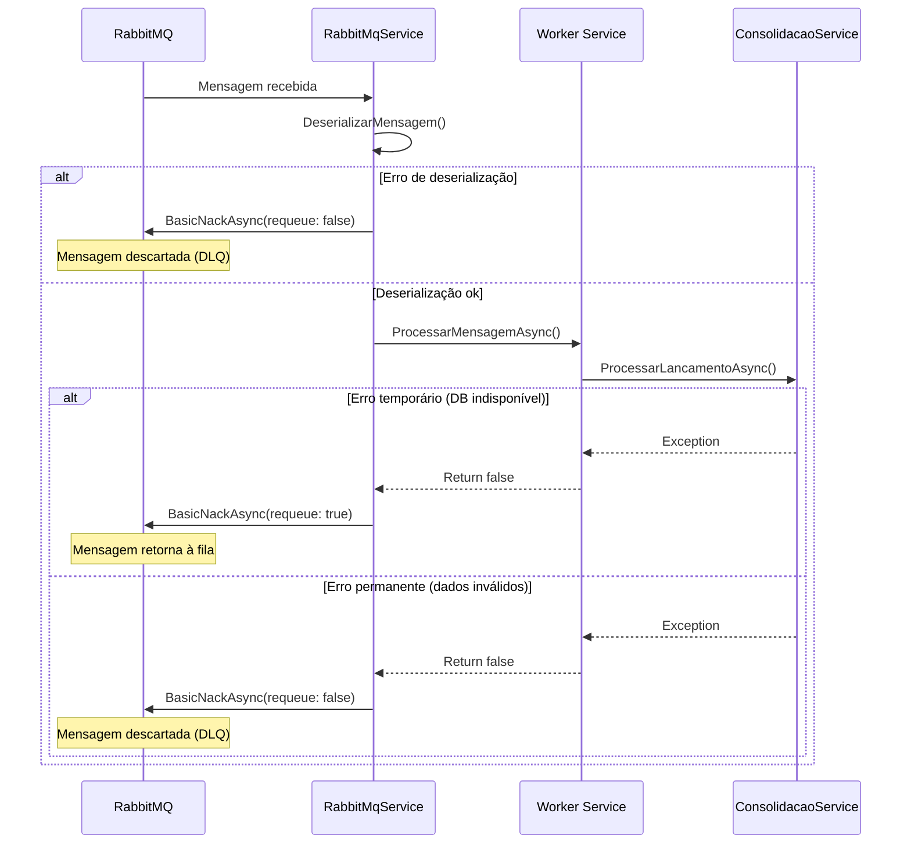

# RProg.FluxoCaixa.Worker

Worker responsável pela consolidação diária de lançamentos do sistema de fluxo de caixa, processamento idempotente de mensagens e integração com RabbitMQ e SQL Server.

## Características

- **Processamento idempotente**: evita duplicidade de lançamentos
- **Consolidação automática**: geral e por categoria
- **Escuta de múltiplas filas RabbitMQ** com prefixo configurável
- **Persistência em SQL Server** via Dapper
- **Logs estruturados** com Serilog (console e arquivo)
- **Recuperação automática** de conexão RabbitMQ
- **Configuração via appsettings e variáveis de ambiente**
- **Containerização Docker pronta para produção**

## Estrutura do Projeto

```
RProg.FluxoCaixa.Worker/
├── Domain/
│   ├── Entities/
│   ├── DTOs/
│   └── Services/
├── Infrastructure/
│   ├── Data/
│   └── Services/
├── Services/
└── Worker.cs
```

### Fluxo de Consolidação via Worker



### Fluxo de Reconexão do Worker (Resiliência)



### Fluxo de Tratamento de Erro na Mensageria



## Configuração

### appsettings.json

```json
{
  "ConnectionStrings": {
    "DefaultConnection": "Server=localhost;Database=FluxoCaixa_Consolidado;Trusted_Connection=true;TrustServerCertificate=true;"
  },
  "RabbitMQ": {
    "HostName": "localhost",
    "UserName": "guest",
    "Password": "guest",
    "QueuePrefix": "fluxo-caixa"
  },
  "Serilog": {
    "MinimumLevel": "Information",
    "WriteTo": [
      { "Name": "Console" },
      { "Name": "File", "Args": { "path": "logs/worker-.txt", "rollingInterval": "Day" } }
    ]
  }
}
```

### Banco de Dados

Execute o script SQL para criar as tabelas:

```bash
sqlcmd -S localhost -U sa -P "SuaSenhaForte123!" -i scripts/criar-banco-consolidado.sql
```

Tabelas criadas:
- **ConsolidadoDiario**: Armazena consolidações diárias
- **LancamentoProcessado**: Controle de idempotência

## Execução

### Desenvolvimento Local (.NET)
```cmd
# Compilar
dotnet build

# Executar
dotnet run --project src/worker/RProg.FluxoCaixa.Worker/RProg.FluxoCaixa.Worker.csproj

# Executar testes
dotnet test src/worker/RProg.FluxoCaixa.Worker.Test/
```

### Docker

```cmd
cd src/
docker-compose up worker
```

#### Docker Standalone
```cmd
cd src/
docker build -t rprog-fluxocaixa-worker -f worker/Dockerfile .
docker run -e ConnectionStrings__DefaultConnection="..." rprog-fluxocaixa-worker
```

## Funcionamento

1. **Escuta**: Conecta ao RabbitMQ e escuta filas com prefixo configurado
2. **Recebimento**: Mensagens são deserializadas para DTOs
3. **Idempotência**: Verifica se o lançamento já foi processado
4. **Consolidação**: Atualiza consolidações geral e por categoria
5. **Confirmação**: Marca mensagem como processada

### Exemplo de Mensagem RabbitMQ

```json
{
  "id": "123e4567-e89b-12d3-a456-426614174000",
  "descricao": "Venda produto XYZ"
}
```

## Monitoramento

- **Logs**: Console e arquivo `logs/worker-*.txt`
- **Métricas**: Mensagens processadas, erros, tempo de resposta
- **Health Check**: Pode ser verificado via logs ou comandos Docker

## Dependências

- **.NET 8.0**
- **Dapper**
- **Microsoft.Data.SqlClient**
- **RabbitMQ.Client**
- **Serilog.AspNetCore**
- **Serilog.Sinks.Console**
- **Serilog.Sinks.File**
- **System.Text.Json**
- **System.ComponentModel.Annotations**

## Padrões e Boas Práticas

- Seguir padrões de codificação C# e nomenclatura conforme instruções do repositório
- Utilizar injeção de dependência sempre que possível
- Separar código em métodos coesos e pequenos
- Utilizar comentários XML e explicativos para regras de negócio e integrações
- Facilitar a criação de testes unitários

## Testes

- Testes unitários obrigatórios para todo novo código
- Utilizar xUnit, Moq, Bogus e FluentAssertions
- Estruturar testes com AAA (Arrange, Act, Assert) e Given/When/Then
- Mocks para dependências externas
- Projeto de testes: `RProg.FluxoCaixa.Worker.Test`

## Links Úteis

- [Especificação de arquitetura](../../docs/documento-arquitetural.md)
- [Diagrama de containers](../../docs/C4DiagramaContainer.png)
- [Diagrama de contexto](../../docs/C4DiagramaContexto.png)

---

> Para dúvidas sobre padrões, consulte o arquivo `.github/instructions/copilot.instructions.md`.
